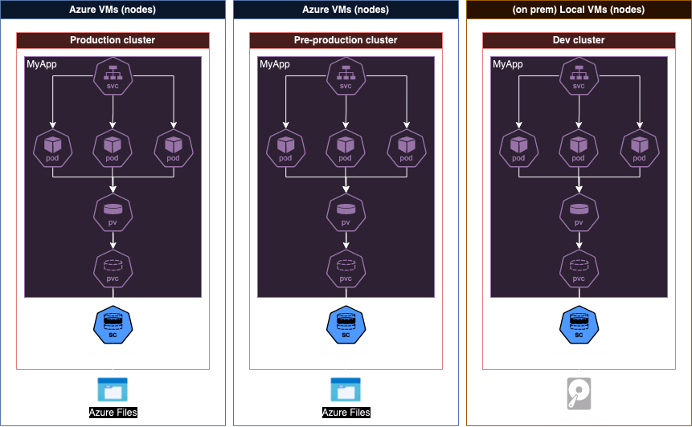

# storageclasses-demo-on-k8s

A small showcase on how you can have different storage classes per environment without much hassle on openshift/kubernetes

## Goal

The goal of this project is to run a simple application (deployment, service) with persistent storage that differs according to the environment it's on. Say for example

- `dev` uses `azure-disk` as storageclass.
- `pre` uses `azure-files`

This is an example, feel free to change the storageclass to suit your needs!

In this diagram, the purple parts are the application, and it does not change across environments, even the `pvc`, which points to a `storageclass` called (in this case) "My-custom-sc".

The `storageclasses` point to Azure Files in Azure, and to Local HDD on the on-prem cluster, but since they are called "My-custom-sc", the pvc will connect to the corresponding `storageclass`, while itself (`pvc`) remains identical across envs.

## Folder structure

- **app**: contains your application. This is the code a developer will create and will only change when the application requires change (but not to change environment)
- **base-manifests**: the kubernetes manifests of the application. These will only change when the odd change needs to happen to the application infrastructure, but not when changing environments (for example when you need to open an extra port or update limits or requests)
- **overlays**: contains the [kustomize](https://kustomize.io/) manifests to update the base-manifests files to suit the corresponding environment. This folder is the only one that needs to be changed according to the different environments.

## Steps

### 1) Setup your (in this case) Azure account

The very first thing we need to do is setup our underlying infrastructure so the cluster can access it properly.

Since we are using Azure products for this particular demo, we will set up a storage account and give permissions to our cluster. It can all be easily done via [this](https://learn.microsoft.com/en-us/azure/openshift/howto-create-a-storageclass#set-up-azure-storage-account) official ARO guide.

### 2) Create a basic deployment, svc... simulating an app
